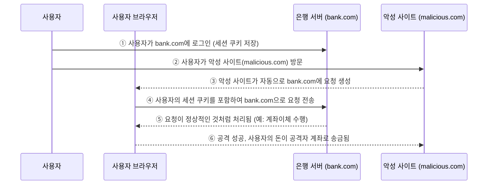

# CSRF 

CSRF (Cross-Site Request Forgery, 크로스 사이트 요청 위조)는 사용자가 모르게 다른 사이트에 요청을 보내도록 속이는 공격이다

### 공격 시나리오




1. **사용자가 `bank.com`에 로그인**

	- 브라우저는 `bank.com`에서 **세션 쿠키**를 저장하고 있음.
	- 이 쿠키는 인증된 요청을 보낼 때 자동으로 포함됨

2.  **사용자가 `malicious.com` 같은 악성 사이트에 접속**

	- 공격자는 사용자가 bank.com에 로그인한 상태임을 노림.
	- 악성 사이트는 숨겨진 `` 태그 또는 `<form>`을 이용해 **bank.com에 요청을 자동으로 보냄.**
```html


%% or %%

<form action="https://bank.com/transfer" method="POST">
	<input type="hidden" name="to" value="attacker">
	<input type="hidden" name="amount" value="1000">
	<input type="submit">
</form>
<script>document.forms[0].submit();</script>
```

3. **악성 사이트가 `bank.com`으로 자동 요청 전송**

	- 예를 들어, 다음과 같은 요청을 자동으로 실행할 수 있음.

4. **브라우저가 `bank.com`으로 요청 전송 (자동 쿠키 포함)**

	- 브라우저는 사용자가 직접 요청을 보냈다고 생각하고, **자동으로 쿠키를 포함하여 bank.com에 요청을 보냄.**
	- 따라서 공격자의 요청이 정상적인 사용자 요청처럼 보임.
	
5. **브라우저가 `bank.com`으로 요청 전송 (자동 쿠키 포함)**
	- `bank.com`은 사용자가 로그인 상태라고 믿고, 공격자의 계좌로 돈을 송금함.
6. **공격 성공, 사용자의 돈이 공격자 계좌로 전송됨**


### 방어 방법:

- **CSRF 토큰 사용**: 모든 중요한 요청(예: 계좌이체, 비밀번호 변경)에 **CSRF 토큰**을 포함하도록 요구 -> 서버는 요청 시 CSRF 토큰이 올바른지 검증하여 차단함
- **SameSite 쿠키 설정**: **쿠키의 `SameSite` 속성**을 `Strict` 또는 `Lax`로 설정하여, 외부 사이트에서 쿠키가 자동으로 전송되지 않도록 한다
- **Referer 또는 Origin 헤더 검증**: 서버에서 `Referer` 또는 `Origin` 헤더를 확인하여, 신뢰할 수 없는 출처에서 온 요청을 차단.
- **[[CORS]] 정책 강화**: 서버에서 `Access-Control-Allow-Origin`을 특정 도메인(`bank.com`)만 허용하도록 설정하여 **다른 사이트(malicious.com)에서 API를 직접 호출하지 못하도록 막음.**