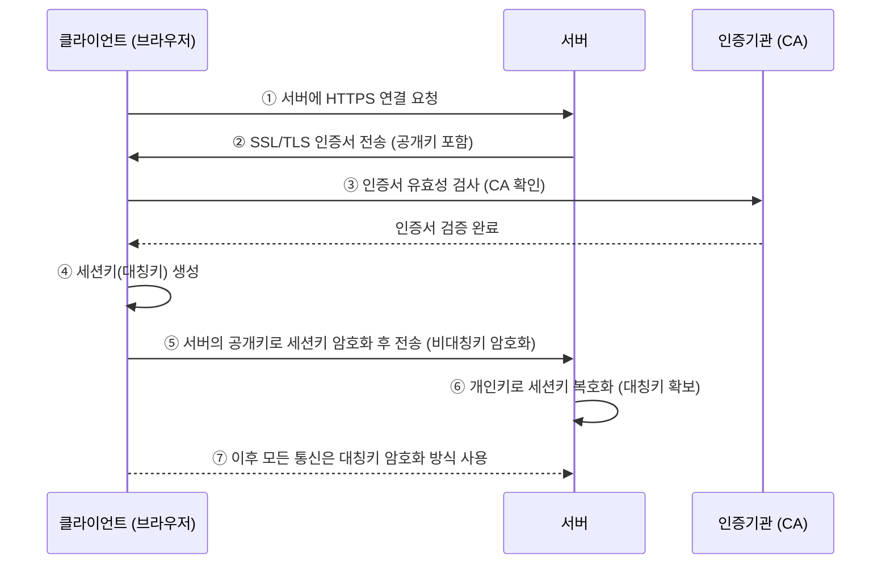

### HTTP (HyperText Transfer Protocol)
- 인터넷에서 데이터를 주고받는 기본적인 프로토콜.
- 인터넷에서 하이퍼텍스트를 교환하기 위한 통신규약으로 80번 포트를 사용 -> HTTP서버가 80번 포트에서 요청을 기다리고 있으며, 클라이언트는 80번 포트로 요청을 보내게 된다.
- 애플리케이션 레벨의 프로토콜로 TCP/IP 위에서 작동
- 상태를 가지고 있지않은 Stateless 프로토콜이며 Method, Path, Headers, Body 등으로 구성
- ==HTTP는 암호화가 되지 않은 평문 데이터를 전송하는 프로토콜이기에, 중요한 데이터는 제 3자가 조회할 수 있는 문제가 있다. 이러한 문제를 해결하기 위해 HTTPS가 등장==
### HTTPS (HyperText Transfer Protocol Secure)
- HTTP에 보안(SSL/TLS 암호화)이 추가되어 더 안전한 통신을 제공하는 프로토콜
- **암호화 O** → 개인정보(비밀번호, 카드정보 등)를 안전하게 보호할 수 있음.
- 443번 포트를 사용

##### HTTPS의 SSL/TLS 암호화 방식
HTTPS는 **SSL/TLS (Secure Sockets Layer / Transport Layer Security)** 프로토콜을 사용하여 데이터를 암호화하고 안전하게 전송하는 방식이다. HTTPS의 보안은 **대칭키 암호화**와 **비대칭키 암호화**를 조합해서 이루어진다.

**비대칭키 암호화 (공개키 암호화)**
- 클라이언트(브라우저)와 서버가 안전한 통신을 하기 전, 먼저 암호화할 **공개키(Public Key)** 와 **개인키(Private Key)** 를 사용해 **TLS 핸드셰이크(TLS Handshake)** 를 진행함.
- 서버는 **공개키(Public Key)** 를 클라이언트에게 제공하고, 클라이언트는 이를 이용해 데이터를 암호화해서 보냄.
- 서버는 자신의 **개인키(Private Key)** 를 사용해 암호화된 데이터를 복호화함.
**대칭키 암호화**
- 비대칭키 암호화는 속도가 느리기 때문에, 초기 연결이 완료되면 클라이언트와 서버는 **대칭키(공유키, Shared Key)** 를 생성해서 사용함.
- 이후의 데이터 통신은 대칭키 암호화를 사용하여 빠르고 안전하게 주고받음.

##### HTTPS의 동작 과정

1. 서버에 HTTPS 연결 요청
	- 사용자가 `https://example.com` 같은 사이트에 접속하면, 클라이언트(브라우저)는 서버와 TLS 연결을 시도
2. SSL/TLS 인증서 전송 (공개키 포함)
	- 서버는 **공개키(Public Key)** 가 포함된 인증서를 브라우저(클라이언트)에게 보냄
	- 인증서는 **CA(Certificate Authority, 인증기관)** 가 발급한 것
3. 인증서 유효성 검사 (CA 확인) -> 인증서 검증 완료
	- 브라우저는 CA 목록과 대조하여 서버 인증서가 유효한지 확인
	- (1) CA 목록 확인, (2) 서명 검증, (3) 유효 기간 확인, (4) 도메인 일치 확인, (5) 인증서 체인 검사
	- 인증서가 유효하면, 공개키를 이용해 이후 데이터를 암호화
4. 세션키(대칭키) 생성
	- 브라우저는 이후 데이터를 암호화할 **세션키(대칭키, Shared Key)** 를 생성
	- 세션키는 빠른 암호화를 위해 사용
5. 서버의 공개키로 세션키 암호화 후 전송 (비대칭키 암호화)
	- 대칭키(세션키)는 보안이 중요한 값이므로, 클라이언트는 서버의 **공개키(Public Key)** 를 이용해 세션키를 암호화
	- 이후 암호화된 세션키를 서버로 전송
6. 개인키로 세션키 복호화 (대칭키 확보)
	- 서버는 자신의 **개인키(Private Key)** 를 사용해 클라이언트가 보낸 **암호화된 세션키** 를 복호화
	- 이제 서버도 동일한 세션키를 가지게 됨
7. 이후 모든 통신은 대칭키 암호화 방식 사용
	- 클라이언트와 서버는 같은 **세션키(Shared Key)** 를 공유하게 되었으므로, 이후 데이터 전송은 **대칭키 암호화 방식**을 사용
	- 대칭키 암호화는 속도가 빠르므로, 실질적인 데이터 송수신이 안전하고 효율적으로 이루어짐

##### SSL/TLS 인증서 (SSL Certificate) 발급 과정
HTTPS를 사용하려면 **SSL/TLS 인증서**가 필요하다.

- 인증서는 **신뢰할 수 있는 기관(CA, Certificate Authority)** 이 발급함.
- 사용자의 브라우저는 웹사이트의 인증서를 확인하고, 신뢰할 수 있는 기관이 발급한 것인지 검증함.
- 인증서가 유효하면 HTTPS 통신이 정상적으로 진행됨.

### HTTP vs HTTPS
HTTP는 암호화 과정이 없기에 보안 취약하지만 속도가 빠르다. 반면 HTTPS는 안전하게 데이터를 주고 받을 수 있지만 암호화/복호화 과정으로 속도가 느리다.(오늘날에는 차이 느끼기 힘듬) 또한 인증서를 발급하고 유지하기위한 비용이 든다.

