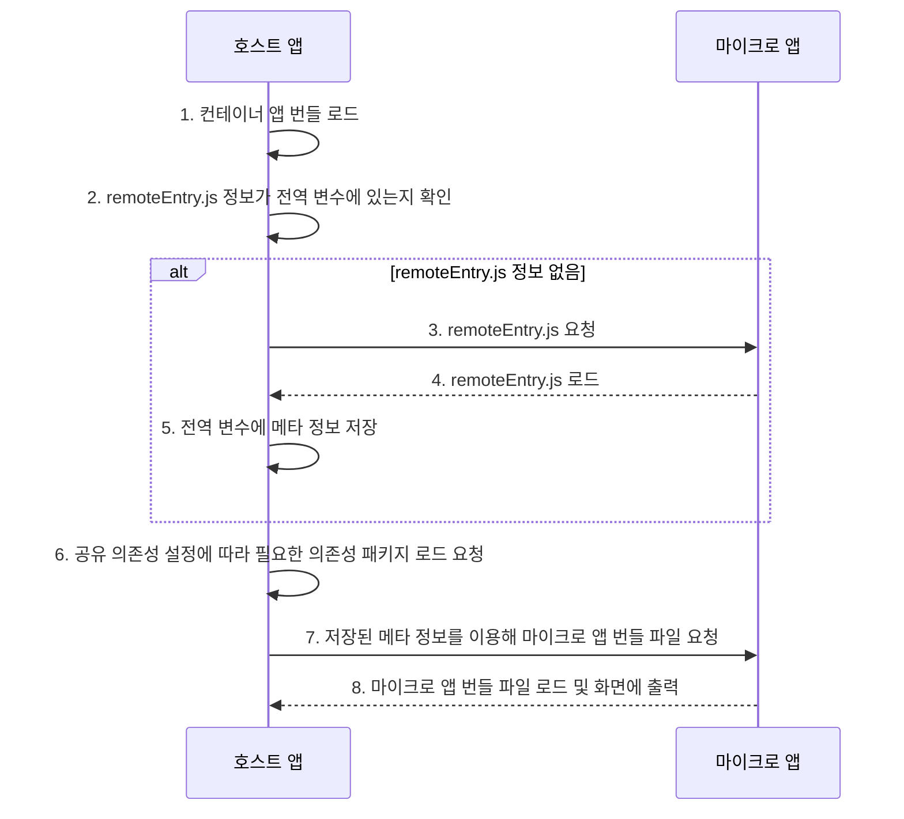

# Module Federation
Module Federation이란 ==하나의 독립적인 배포가 가능한 모듈 단위(청크)로 나누어 브라우저에서 런타임에 통합==하는 개념이다. 좀 쉽게 표현하면 다른 앱에 있는 컴포넌트를 내보내거나 불러와 사용할 수 있다.
(MFA와 상응 개념은 아니고 구현체 중 하나임)

기능: 
- 자바스크립트 애플리케이션 간 코드 공유

목적:
- 코드 중복 줄이기
- 코드 유지 관리성 개선
- 애플리케이션 전체 크기를 줄임
- 성능 향상 (컨테이너 빌드를 따로 하므로 빌드 시간, 영향 범위, 로딩 시간 측면에서 유리)

### Module Federation 작동방식

>[!summary]
>
>1. 호스트앱이 마이크로 앱에 remoteEntry 요청
>2. 컨테이너앱의 전역 변수에 마이크로앱 메타정보 저장 (remoteEntry)
>3. 공유 의존성 설정에따라 필요한 의존성 패키지를 컨테이너에 로드되어지도록 요청
>4. 사용되는 시점에 초기에 저장한 메타정보를 이용해 마이크로앱 번들파일 요청
>5. 번들파일이 로드되고 화면에 출력

1. [^1]컨테이너앱 번들 로드
2. 마이크로 앱에서 가지고 있는 remoteEntry.js 정보가 전역변수에 있는지 확인
3. 없으면 마이크로앱에게 리모트엔트리를 요청
4. 마이크로앱의 리모트엔트리 로드
5. 컨테이너는 전역 변수에 메타정보 저장
6. 컨테이너가 공유 의존성 설정에따라 필요한 의존성 패키지를 컨테이너에 로드되어지도록 요청
7. 마이크로앱이 사용되는 시점에 초기에 저장한 메타정보를 이용해 마이크로앱 번들파일 요청
8. 마이크로앱을 통해 번들파일이 로드되고 화면에 출력

### 앱 간 커뮤니케이션 방법 비교: Props vs Storage vs Custom Event

| **기준**          | **Props**                                                                  | **Storage (localStorage, sessionStorage)**                             | **Custom Event (커스텀 이벤트)**                          |
| --------------- | -------------------------------------------------------------------------- | ---------------------------------------------------------------------- | --------------------------------------------------- |
| **장점**          | - 가장 간단한 방법   - 타입 안전성 보장                                               | - 전역 데이터 공유 용이   - 페이지 새로고침 후에도 데이터 유지(localStorage의 경우)            | - 느슨한 결합 구조   - 실시간 데이터 전달 가능  - 확장성 및 유연성 우수 |
| **단점**          | - 컴포넌트 트리의 깊은 전달 시 복잡성 증가   - 부모-자식 구조에 의존   - 호스트/리모트가 같은 프레임워크여야 함 | - 실시간 동기화 어려움   - 같은 탭 내에서는 `storage` 이벤트가 동작하지 않음   - 데이터 충돌 위험 | - 초기 설정 필요(이벤트 버스 또는 리스너 등록)   - 디버깅 난이도 ↑       |
| **의존성**         | 높음 (부모-자식 간 강한 결합)                                                         | 중간 (전역 저장소에 의존)                                                        | 낮음 (이벤트 기반으로 느슨한 결합 유지)                             |
| **실시간성**        | 제한적 (Props 변경 시 리렌더링 필요)                                                   | 없음 (탭 간 동기화만 가능, 같은 탭 내에서는 불가)                                         | 우수 (즉각적인 이벤트 전파 가능)                                 |
| **확장성**         | 낮음 (복잡한 구조일수록 관리 어려움)                                                      | 낮음 (복잡한 데이터 구조 처리 한계)                                                  | 높음 (여러 앱/모듈 간 확장 가능)                                |
| **보안 및 데이터 관리** | 안전 (내부 데이터만 전달)                                                            | 보안 위험 존재 (클라이언트에 데이터 노출)                                               | 상대적으로 안전 (필요한 데이터만 전송)                              |
| **주요 사용 사례**    | 간단한 부모-자식 간 데이터 전달                                                         | 페이지 간 상태 유지 또는 간단한 플래그 공유                                              | 독립된 모듈 간 이벤트 처리, 실시간 데이터 전파                         |

>[!warning]
>postMessage와 같은 messageAPI는 **크로스-도메인** 또는 **윈도우 간** 통신을 위해 설계되었다. 같은 SPA(Single Page Application)나 모듈 페더레이션 구조에서는 **독립된 윈도우 객체가 없으므로** 불가능

[^1]: 각각의 빌드 (하나의 빌드는 하나의 웹 애플리케이션을 표현)
